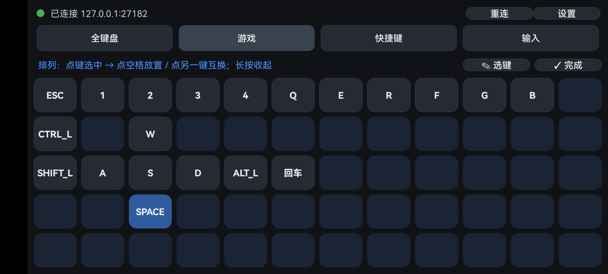
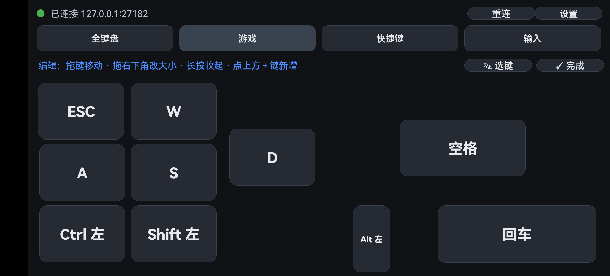

<div align="center">

# KeyBridge · 手机变电脑键盘

**把安卓手机变成电脑的虚拟键盘 —— USB 数据线（免 root）或同一 WiFi 连接，按键实时注入电脑。**
*Turn your Android phone into a PC keyboard over USB or WiFi.*

[](https://github.com/jur10n/KeyBridge/actions/workflows/build-apk.yml)
[](https://github.com/jur10n/KeyBridge/releases/latest)
[](LICENSE)


 

**下载** → [Latest Release](https://github.com/jur10n/KeyBridge/releases/latest)

</div>

---

## 功能

| 模式 | 内容 |
|---|---|
| 全键盘 | F1-F12、完整主键区、修饰键组合、方向/编辑键，按住自动重复，多指同按 |
| 游戏键盘 | **自由布局**：每个键独立位置和大小 —— 拖动移动、拖右下角缩放、长按收起到托盘；WASD 对齐手感自己调；按住多久生效多久，绝不自动锁定 |
| 快捷键 | Ctrl+C/V/Z/S、Alt+Tab、Alt+F4、Win+D/L/R、任务管理器、截屏、音量/播放多媒体控制 |
| 输入 | 手机上打字以 Unicode 实时注入电脑，回车/退格同步转发 |

- 屏幕自适应：键盘整体等比拉伸铺满手机屏幕（横竖屏皆可）
- 布局实时保存：键位、大小、勾选状态重启不丢
- 屏幕常亮、沉浸全屏、断线自动重连；断开时 PC 端自动释放所有按键，不会卡键

## 原理

```
┌──────────┐  TCP（adb reverse USB 隧道 / WiFi） ┌─────────────┐ SendInput ┌──────┐
│ 手机 App │ ──────────────────────────────────▶ │ pc/         │ ────────▶ │ 电脑 │
│ 触摸→JSON│   {"t":"k","c":"W","d":1}           │ keybridge_  │           │ 系统 │
└──────────┘                                     │ server.py   │           └──────┘
                                                 └─────────────┘
```

- **USB 模式（推荐，免 root）**：电脑端脚本自动执行 `adb reverse tcp:27182 tcp:27182`，
  手机 App 连接自己的 `127.0.0.1:27182` 即可经 USB 隧道到达电脑。
- **WiFi 模式**：电脑端 `--lan` 启动，手机 App「设置」里填电脑局域网 IP。
- 普通按键用**扫描码**注入，DirectInput/老游戏也能识别；文本走 Unicode 逐字符注入。

## 快速开始

1. 手机安装 [最新版 APK](https://github.com/jur10n/KeyBridge/releases/latest)，开启「开发者选项 → USB 调试」，数据线连电脑
2. 电脑运行 `pc/start_server.bat`（需要 adb；Python 3.6+ 纯标准库，**无需 pip 安装任何依赖**）
3. App 顶部变绿「已连接」即可使用；横屏体验最佳

**WiFi 模式**：电脑 `python pc/keybridge_server.py --lan`（放行防火墙），App「设置」里把主机地址改成电脑 IP（`ipconfig` 查看 IPv4）。

## 构建

```bash
git clone https://github.com/jur10n/KeyBridge.git
cd KeyBridge
./gradlew :app:assembleDebug
# 产物: app/build/outputs/apk/debug/app-debug.apk
```

需要 JDK 17+ 和 Android SDK（`ANDROID_HOME`）。也可用 Android Studio 直接打开工程，
或推送到 GitHub 让 [Actions](https://github.com/jur10n/KeyBridge/actions) 自动构建 APK。

## 游戏键盘编辑模式（⇄ 调位置）

| 操作 | 效果 |
|---|---|
| 拖动按键 | 自由移动到任意位置（不吸附格子） |
| 拖动按键右下角 | 任意调整宽高（空格键拉大、技能键缩小随你） |
| 长按按键 | 收起到托盘 |
| 点顶部「＋键」 | 把托盘里的键添加进布局 |
| ✎ 选键 | 勾选哪些键可用（45 个候选：WASD、Ctrl/Shift/Alt、数字、符号、方向、多媒体等） |

所有改动实时保存。

## 常见问题

- **一直显示未连接？** 检查电脑脚本是否在运行 → `adb devices` 是否列出设备且无 `unauthorized` → 换数据线/USB 口 → 或改用 WiFi 模式。
- **游戏里按键无效？** 以管理员身份重新运行电脑脚本（部分游戏拦截非管理员进程的注入输入）。
- **按键卡住？** 断开连接时电脑端会自动释放所有按住的键；也可以点 App 顶部「重连」。
- **安装被拒绝？** 部分国产 ROM（MIUI/澎湃等）对 adb 安装需在手机上手动确认。

## 自定义

- 按键布局：`app/src/main/java/com/keybridge/keyboard/KeyDefs.kt`
- 键名 → 扫描码映射：`pc/keybridge_server.py` 顶部 `SCAN` / `VK` 表
- 端口：App「设置」+ 电脑端 `--port`（两边保持一致）

## 目录结构

```
app/         安卓工程（Kotlin，零第三方依赖，minSdk 24）
pc/          电脑端脚本 + 一键启动 bat
docs/        截图
.github/     CI 自动构建 APK
```

## 适用范围

适用于自有电脑的办公、演示、模拟器、单机游戏等场景。部分带反作弊的网络游戏会拦截
SendInput 级注入，请遵守目标软件的使用条款。

## 许可证

[MIT](LICENSE) © 2026 jur10n
